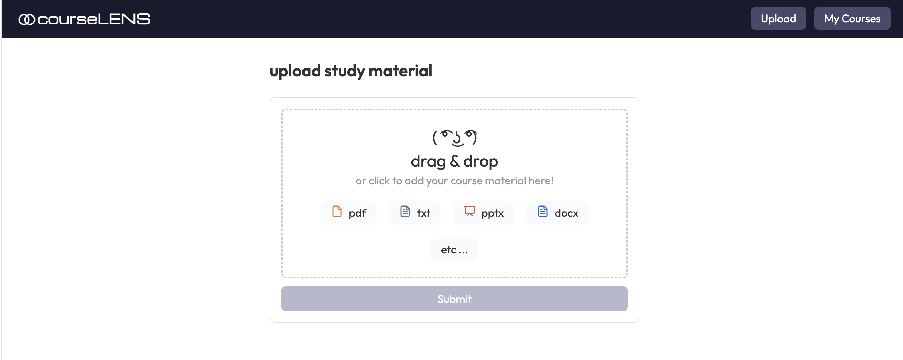

**CourseLENS** is an application designed to help with studying by collecting learning material of various formats, and embedding it into a single space. 
This effectively allows the whole course's content to be queried, and, bundled with a chat agent (Lenny) and question generation features, could come quite useful as a study tool.

## Setup

1.  **Python environment**
The project uses a python server to handle most embedding and LLM tasks.
```bash

python -m venv venv

source venv/bin/activate # Windows: .\venv\Scripts\activate

pip install -r requirements.txt

```
2.  **Environment variables** – Copy `.env.example` to `.env` and fill in:

-  `OPENAI_API_KEY` – 

-  `UNSTRUCTURED_API_KEY` & `UNSTRUCTURED_API_URL` 

-  `QDRANT_URL`, `QDRANT_API_KEY` and `QDRANT_COLLECTION`

Optionally, you can also setup Langsmith:
- `LANGSMITH_TRACING="true"`
`LANGSMITH_API_KEY`

3.  **Run the app**

```bash

npm run dev

```

Opens Next.js (port 3000) and the Python API (port 8000). 
Access the website at `http://localhost:3000/` 
